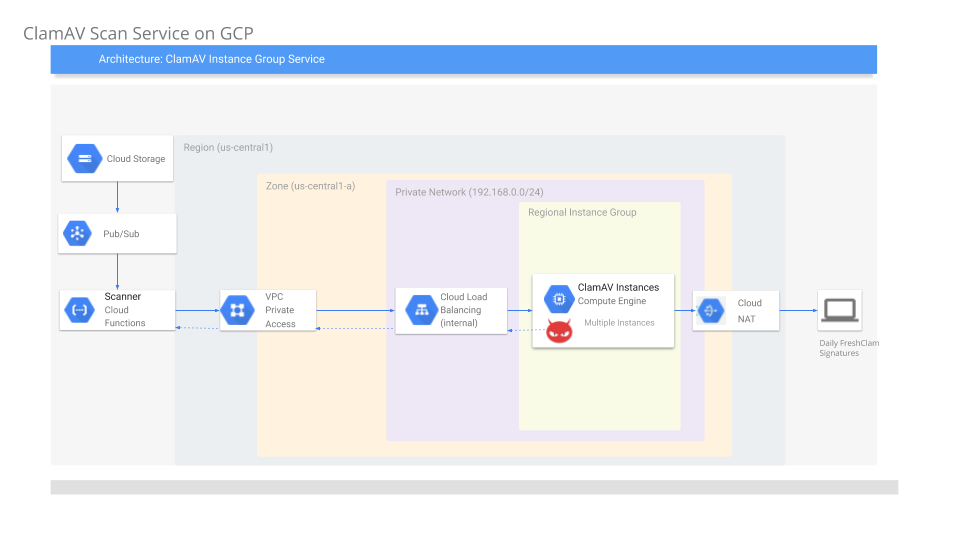
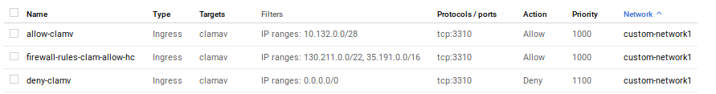
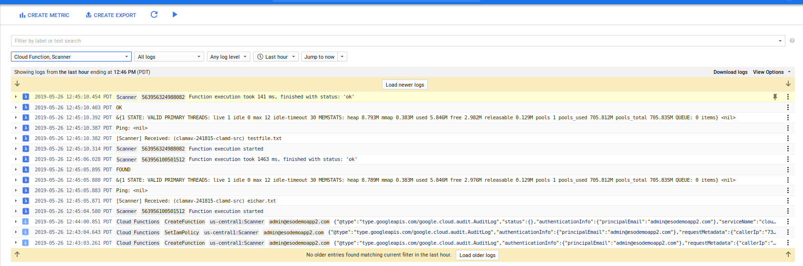

# Anti Virus file scanning on Google Cloud Storage using ClamAV

Tutorial on how to use [ClamAV](https://www.clamav.net/) to scan files uploaded to Google Cloud Storage (GCS).

GCS does not have any built in capability to scan or do any other type of preprocessing on its files and relies on other services to perform these steps.  In this tutorial, we will process a file that gets uploaded to GCS for viruses, malware, etc using [ClamAV](https://www.clamav.net/).  

## Architecture

The basic flow outlined here is:

1. User uploads a file to  [Cloud Storage](https://cloud.google.com/storage/docs/)

2. once uploaded, [Cloud Storage Object Change Notification](https://cloud.google.com/storage/docs/object-change-notification) get triggered.

3. Notifiation invokes a [Cloud Functions](https://cloud.google.com/functions/docs/)

4. Cloud Function (GCF) reads the file _as a stream_ 

5. GCF uses [Cloud Functions Private Access VPC](https://cloud.google.com/functions/docs/connecting-vpc) to send the file stream to a VM running ClamAV

6. GCF dials an [Internal Load Balancer](https://cloud.google.com/load-balancing/docs/internal/) IP address

7. ILB connects with an autoscaled [Managed Instance Group](https://cloud.google.com/compute/docs/instance-groups/#managed_instance_groups) running ClamAV.  Clam AV process the stream and responds back to GCF with an assessment of the file

(ClamAV periodically requests updated virus definitions using [Cloud NAT](https://cloud.google.com/nat/docs/overview) for external communication.)





### Setup


#### Set Environment Variables

```bash
export GOOGLE_PROJECT_ID=`gcloud config get-value core/project`
export GOOGLE_PROJECT_NUMBER=`gcloud projects describe $GOOGLE_PROJECT_ID --format="value(projectNumber)"`
export BUCKET_SRC=`gcloud config get-value core/project`-clamd-src
export QURANTINE_DEST=`gcloud config get-value core/project`-clamd-qurantine
export REGION=us-central1
export ZONE=us-central1-a
```


#### Configure Custom Network


```bash
gcloud compute networks create custom-network1 --subnet-mode custom
gcloud compute networks subnets create subnet-$REGION-192  --network custom-network1 --region $REGION --range 192.168.1.0/24
```

note: we are creating a custom subnet `192.168.1.0/24` used exclusively for the ClamAV cluster.  You can use any network but this setup sets up a custom range that can be isolated easily.


#### Configure Cloud NAT

Setup NAT on the custom subnet where each ClamAV instance can request updated virus definitions.

```bash
gcloud compute routers create nat-router  --network custom-network1  --region  $REGION 

gcloud compute routers nats create nat-config  \
      --router=nat-router     --auto-allocate-nat-external-ips  \  
      --nat-custom-subnet-ip-ranges=subnet-$REGION-192  --region  $REGION 
```

#### GCS

- Create GCS buckets and set iam permissions


```bash
gsutil mb -c regional -l $REGION -p ${GOOGLE_PROJECT_ID} gs://${BUCKET_SRC}
gsutil mb -c regional -l $REGION -p ${GOOGLE_PROJECT_ID} gs://${QUARANTINE_DEST}
```

- `BUCKET_SRC` is the GCS bucket where your users upload files to.

- `QUARANTINE_DEST` is the GCS bucket where files with a detected virus will be saved.  At the moment, the GCF function _does not_ utilize this bucket and instead simply run analysis on the file.


- allow GCF to read from source and write to the quarantine.

```bash
gsutil iam ch  serviceAccount:$GOOGLE_PROJECT_ID@appspot.gserviceaccount.com:roles/storage.objectViewer gs://${BUCKET_SRC}
gsutil iam ch  serviceAccount:$GOOGLE_PROJECT_ID@appspot.gserviceaccount.com:roles/storage.objectCreator gs://${QUARANTINE_DEST}
```

- Here we are using GCF's default service account: `$GOOGLE_PROJECT_ID@appspot.gserviceaccount.com`

#### VPC Connector

- Setup a VPC connector for GCF to connect to the GCE network (ie, ultimately the ILB)

```bash
gcloud services enable cloudfunctions.googleapis.com

gcloud projects add-iam-policy-binding $GOOGLE_PROJECT_ID \
--member=serviceAccount:service-$GOOGLE_PROJECT_NUMBER@gcf-admin-robot.iam.gserviceaccount.com \
--role=roles/viewer

gcloud projects add-iam-policy-binding $GOOGLE_PROJECT_ID \
--member=serviceAccount:service-$GOOGLE_PROJECT_NUMBER@gcf-admin-robot.iam.gserviceaccount.com \
--role=roles/compute.networkUser

gcloud beta compute networks vpc-access connectors create myconnector --network=custom-network1 --region=$REGION --range=10.132.0.0/28
```

Note the IP range `10.132.0.0/28`:  this is the range that traffic _from_ GCF will appear to originate from to the custom GCE network we just setup.


#### ILB+ MIG


- Create MIG Template 

```bash

cd igm/

gcloud compute instance-templates create clamav-template --no-address --no-scopes --no-service-account --machine-type g1-small --tags clamav  --network custom-network1 \
    --image-family=debian-9  --image-project=debian-cloud  --subnet=subnet-$REGION-192 --region $REGION \
    --metadata-from-file startup-script=startup.sh
```

- Create Firewall rules
```
gcloud compute  firewall-rules create firewall-rules-clam-allow-hc  --priority=1000 --network custom-network1  --allow=tcp:3310 --source-ranges=130.211.0.0/22,35.191.0.0/16  --target-tags=clamav 

gcloud compute firewall-rules create deny-clamv --direction=INGRESS --priority=1100 --network=custom-network1 --action=DENY --rules=tcp:3310 --source-ranges=0.0.0.0/0 --target-tags=clamav

gcloud compute firewall-rules create allow-clamv --direction=INGRESS --priority=1000 --network=custom-network1 --action=ALLOW --rules=tcp:3310 --source-ranges=10.132.0.0/28 --target-tags=clamav
```

These firewall rules are important
- First rule allows GCP's loadbalancer to perform `TCP` healthchecks
- Second rule _prevents_ anyone accessing the ClamAV listener port `3310`
- Third rule allows traffic orignating from the GCF to access the ClamAV instance's listener port



- Enable HealthCheck

```
gcloud compute health-checks create tcp hc-tcp-3310 \
    --check-interval=5s \
    --timeout=5s \
    --healthy-threshold=2 \
    --unhealthy-threshold=2 \
    --port=3310 
```

- Define MIG and AutoScaling

```bash
gcloud compute instance-groups managed create  clam-central-ig  --base-instance-name clamav --template=clamav-template --size=1 --zone=$ZONE

gcloud compute instance-groups managed set-autoscaling clam-central-ig \
    --max-num-replicas 3 \
    --target-load-balancing-utilization 0.6 \
    --cool-down-period 90 --zone=$ZONE
```

A couple notes about the member VMs in this instance group.  These VMs are small (g1), have _NO_ public IP addresses and have _NO_ GCP service accounts.  We do this to limit its privileges.  Also note that in the firewall rules for the custom subnet, we did _not_ even define `ssh` access (port 22).


- Define and add Backend Service

```bash
gcloud compute backend-services create clam-map-backend-service  --load-balancing-scheme=internal \
  --protocol TCP --health-checks hc-tcp-3310 --region $REGION

gcloud compute backend-services add-backend clam-map-backend-service \
    --instance-group clam-central-ig \
    --instance-group-zone $ZONE --region $REGION
```

- Add Forwarding rule and ILB IP

```bash
gcloud compute forwarding-rules create clam-ilb \
    --region=$REGION \
    --load-balancing-scheme=internal \
    --ip-protocol=TCP \
    --ports=3310  --network custom-network1 \
    --backend-service=clam-map-backend-service --subnet=subnet-$REGION-192 \
    --backend-service-region=$REGION
```

- Acquire and note down the ILB IP that is allocated

In my case it is

```bash
$ gcloud compute forwarding-rules describe   clam-ilb --region $REGION --format="value(IPAddress)"
192.168.1.6
```

Export the IP as a variable:

```bash
export ILB_IP=192.168.1.6
```

#### Create GCF

- Define the GCF function

```bash
cd gcf/

gcloud beta functions deploy Scanner --entry-point=Scanner --runtime go111 \
  --trigger-resource=${BUCKET_SRC} --set-env-vars=BUCKET_DST=${BUCKET_DEST},ILB_IP=$ILB_IP \
  --trigger-event=google.storage.object.finalize --project=${GOOGLE_PROJECT_ID} \
  --timeout=540s --memory=256MB --vpc-connector projects/$GOOGLE_PROJECT_ID/locations/$REGION/connectors/myconnector
```

-------------------------------------------

### Test

Now that we have defined all the components, upload a sample test file and a file with a known _test_ virus that ClamAV can detect

```bash
echo "hello world" > testfile.txt
gsutil cp testfile.txt  gs://${BUCKET_SRC}
```

- eichar.txt:
`X5O!P%@AP[4\PZX54(P^)7CC)7}$EICAR-STANDARD-ANTIVIRUS-TEST-FILE!$H+H*`

```bash
gsutil cp eichar.txt  gs://${BUCKET_SRC}
```

Once uploaded, you should see the the files getting processed:  `OK` means nothing found..and quite vaguely `FOUND` means a virus is found in that file.




### Limits

- GCF can run for at most `540s` so any file that is streamed to the VM must finish within this timeline.  If you need additional time, consider Cloud Run.

## References

- LICENSE

This sample uses a golang library shim for clamv.  For attribution and license, please see [https://github.com/dutchcoders/go-clamd](https://github.com/dutchcoders/go-clamd).


- [GPG stream encryption and decryption on Google Cloud Functions and Cloud Run](https://medium.com/google-cloud/gpg-stream-encryption-and-decryption-on-google-cloud-functions-and-cloud-run-8cb732404134)
